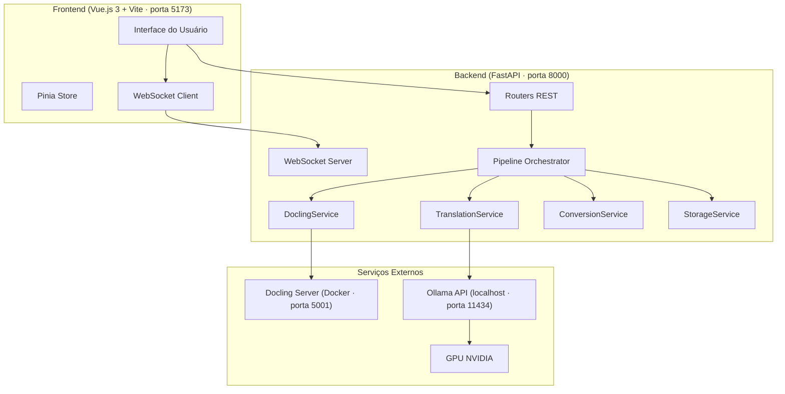

# 📄 DocFlow

> Pipeline local de conversão, tradução e exportação de documentos PDF via [Docling](https://github.com/DS4SD/docling) + [Ollama](https://ollama.com).

**Autor:** Maxwell Anderson Ielpo Amaral  
**Versão:** 0.1.0  
**Licença:** Livre com Citação Obrigatória — veja [LICENSE](LICENSE)

---

## ✨ Funcionalidades

- Upload de PDFs via interface web
- Conversão de PDF → HTML estruturado com figuras embutidas (Docling Server via Docker + GPU)
- Tradução automática HTML → Português (Brasil) com o modelo `translategemma:4b` via Ollama (GPU local)
- Exportação dos documentos traduzidos para `.docx` e `.pdf`
- Gerenciamento de arquivos de entrada e saída pela interface
- Monitoramento de progresso em tempo real via WebSocket
- Execução completa (backend + frontend) com um único comando: `uv run docflow`

---

## 🗺️ Arquitetura



---

## 📁 Estrutura do Projeto

```
docflow/
├── pyproject.toml                  ← configuração do projeto (uv)
├── .env.example                    ← variáveis de ambiente (copiar para .env)
├── docker-compose-docling-server.yaml
│
├── backend/                        ← API FastAPI (Python 3.10+)
│   ├── main.py                     ← entrypoint (app + run())
│   ├── api/
│   │   ├── router_upload.py        ← POST /upload
│   │   ├── router_pipeline.py      ← POST /pipeline/start · WS /pipeline/ws/{id}
│   │   ├── router_download.py      ← GET /download/{path}
│   │   └── router_files.py         ← CRUD /files/input · /files/output
│   ├── services/
│   │   ├── docling_service.py      ← integração Docling (fluxo async)
│   │   ├── translation_service.py  ← integração Ollama
│   │   ├── conversion_service.py   ← HTML → .docx / .pdf
│   │   └── storage_service.py      ← gestão de ./input e ./output
│   ├── models/
│   │   └── schemas.py              ← Pydantic models
│   └── core/
│       ├── config.py               ← Settings (pydantic-settings + .env)
│       └── pipeline.py             ← orquestrador assíncrono
│
├── frontend/                       ← SPA Vue.js 3 + Vite
│   ├── src/
│   │   ├── App.vue
│   │   ├── components/
│   │   │   ├── UploadPanel.vue
│   │   │   ├── PipelineMonitor.vue
│   │   │   ├── DownloadPanel.vue
│   │   │   ├── FilesPanel.vue
│   │   │   └── OutputNode.vue
│   │   ├── stores/pipeline.ts      ← Pinia store
│   │   └── api/client.ts           ← axios wrapper
│   └── package.json
│
├── tests/                          ← pytest (47 testes)
│   ├── conftest.py
│   ├── test_pipeline.py
│   ├── test_storage_service.py
│   ├── test_docling_service.py
│   ├── test_translation_service.py
│   ├── test_conversion_service.py
│   ├── test_api_upload.py
│   ├── test_api_pipeline.py
│   ├── test_api_download.py
│   └── test_api_files.py
│
├── specs/                          ← especificações do projeto
│   ├── requirements.md
│   ├── architecture.md
│   └── roadmap.md
│
├── input/                          ← PDFs de entrada (criado em runtime)
└── output/                         ← arquivos processados (criado em runtime)
    └── YYYY-MM-DD/
        ├── html/
        ├── translated/
        ├── docx/
        └── pdf/
```

---

## ⚙️ Pré-requisitos

| Requisito | Versão mínima | Observação |
|---|---|---|
| Linux ou WSL2 (Ubuntu 22.04+) | — | Testado em Ubuntu 24.04 e WSL2 |
| Python | 3.10+ | Gerenciado pelo `uv` |
| [uv](https://docs.astral.sh/uv/) | 0.5+ | Gerenciador de pacotes e runtime |
| Node.js | 20+ | Para o frontend Vue.js |
| npm | 10+ | Incluído no Node.js |
| Docker Engine + Docker Compose | 24+ | Para o Docling Server |
| NVIDIA Driver + CUDA | ≥ 12.8 | Para aceleração GPU no Docling e Ollama |
| [Ollama](https://ollama.com) | 0.5+ | Inference local do modelo de tradução |

### Verificar pré-requisitos

```bash
python3 --version   # >= 3.10
uv --version
node --version      # >= 20
docker --version
docker compose version
nvidia-smi          # confirma driver + GPU
ollama --version
```

---

## 🚀 Instalação

### 1. Clonar o repositório

```bash
git clone https://github.com/maxwellamaral/docflow.git
cd docflow
```

### 2. Instalar o `uv` (caso não tenha)

```bash
# Linux / WSL
curl -LsSf https://astral.sh/uv/install.sh | sh
source $HOME/.local/bin/env   # ou reabra o terminal
```

### 3. Instalar dependências Python

```bash
uv sync
```

### 4. Instalar dependências do frontend

```bash
cd frontend && npm install && cd ..
```

### 5. Configurar variáveis de ambiente

```bash
cp .env.example .env
# edite .env se necessário (portas, diretórios, etc.)
```

### 6. Iniciar o Docling Server (Docker + GPU)

```bash
docker compose -f docker-compose-docling-server.yaml up -d
# Aguarde o download da imagem na primeira execução (~10 GB)
# Acompanhe os logs:
docker logs -f docling-serve
```

> A interface de testes do Docling estará disponível em `http://localhost:5001/ui` após a inicialização.

### 7. Instalar o Ollama e o modelo de tradução

```bash
# Instalar Ollama (Linux / WSL)
curl -fsSL https://ollama.com/install.sh | sh

# Iniciar o serviço Ollama (se não estiver rodando)
ollama serve &

# Baixar o modelo de tradução (aprox. 3 GB)
ollama pull translategemma:4b
```

> **WSL2:** Para acesso à GPU no WSL, certifique-se de que o [NVIDIA Container Toolkit](https://docs.nvidia.com/datacenter/cloud-native/container-toolkit/install-guide.html) e o driver CUDA para WSL estão instalados.

---

## ▶️ Uso

### Iniciar a aplicação completa

```bash
uv run docflow
```

Este único comando inicia simultaneamente:
- **Backend** FastAPI em `http://localhost:8000`
- **Frontend** Vue.js em `http://localhost:5173`

Abra o navegador em **http://localhost:5173**.

### Fluxo de uso

1. **📤 Envio de PDFs** — arraste ou selecione PDFs no painel "Envio de PDFs"
2. **⚙️ Pipeline** — clique em "▶ Iniciar Pipeline" para processar:
   - PDF → HTML (Docling)
   - HTML → HTML traduzido (Ollama `translategemma:4b`)
   - HTML → `.docx` e `.pdf`
3. **⬇️ Downloads** — baixe os arquivos gerados na aba correspondente
4. **🗂 Gerenciar Arquivos** — gerencie os arquivos de entrada e saída

### Acessar apenas a API

A documentação interativa (Swagger) estará disponível em:  
`http://localhost:8000/docs`

---

## 🧪 Desenvolvimento e Testes

```bash
# Executar todos os testes
uv run pytest

# Com saída detalhada
uv run pytest -v

# Com cobertura (requer pytest-cov)
uv run pytest --cov=backend --cov-report=term-missing
```

### Build do frontend

```bash
cd frontend
npm run build   # gera ./frontend/dist/
```

---

## 📋 Configuração (`.env`)

| Variável | Padrão | Descrição |
|---|---|---|
| `DOCLING_BASE_URL` | `http://localhost:5001` | URL do Docling Server |
| `OLLAMA_BASE_URL` | `http://localhost:11434` | URL do servidor Ollama |
| `OLLAMA_MODEL` | `translategemma:4b` | Modelo de tradução |
| `OLLAMA_TIMEOUT` | `600` | Timeout (s) para requests ao Ollama |
| `TARGET_LANGUAGE` | `Portuguese (Brazil)` | Idioma de destino |
| `INPUT_DIR` | `./input` | Pasta de entrada (PDFs) |
| `OUTPUT_DIR` | `./output` | Pasta de saída (resultados) |
| `BACKEND_HOST` | `0.0.0.0` | Host do servidor uvicorn |
| `BACKEND_PORT` | `8000` | Porta do servidor uvicorn |

---

## 📖 Citação

Se você utilizar este software em pesquisas, publicações ou trabalhos acadêmicos, a citação é **obrigatória** conforme os termos da [licença](LICENSE).

```bibtex
@software{amaral2026docflow,
  author       = {Amaral, Maxwell Anderson Ielpo},
  title        = {{DocFlow}: Pipeline local de conversão, tradução e
                  exportação de documentos {PDF} via Docling e Ollama},
  year         = {2026},
  version      = {0.1.0},
  url          = {https://github.com/maxwellamaral/docflow},
  note         = {Software de código aberto sob Licença Livre com
                  Citação Obrigatória}
}
```

O arquivo completo de citação está disponível em [CITATION.bib](CITATION.bib).

---

## 🤖 Declaração de Uso de Inteligência Artificial

Este projeto foi desenvolvido com auxílio de ferramentas de **Inteligência Artificial Generativa** (IAG), especificamente o **GitHub Copilot** com modelo **Claude Sonnet**, integrado ao ambiente de desenvolvimento VS Code.

O uso de IAG compreendeu as seguintes atividades:

- Geração e revisão de código-fonte (backend Python e frontend Vue.js)
- Desenvolvimento orientado a testes (TDD) com ciclos Red-Green-Refactor
- Refatoração e correção de bugs
- Elaboração de documentação técnica (docstrings, README, especificações)
- Sugestão de arquitetura e decisões de design

**Responsabilidade:** Toda saída gerada pela IAG foi revisada, validada e aprovada pelo autor. O autor assume integral responsabilidade pelo conteúdo, pelas decisões de design e pela qualidade do software aqui publicado.

**Transparência:** A declaração de uso de IAG segue as diretrizes emergentes de boas práticas em desenvolvimento de software assistido por inteligência artificial.

---

## 📜 Licença

Copyright © 2026 Maxwell Anderson Ielpo Amaral.

Este software é distribuído sob a **Licença Livre com Citação Obrigatória**.  
Uso, modificação e redistribuição são permitidos, desde que a devida atribuição ao autor seja mantida e que, em publicações acadêmicas ou técnicas que utilizem ou derivem deste software, a citação bibliográfica seja incluída.

Veja o arquivo [LICENSE](LICENSE) para os termos completos.
