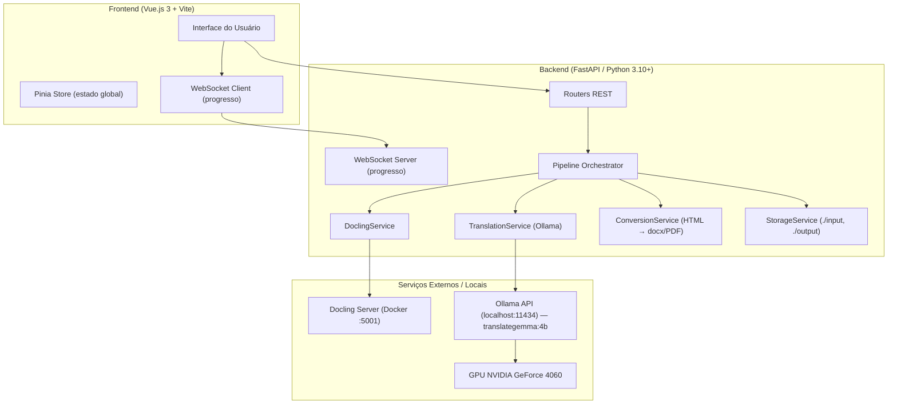

# Arquitetura do Sistema — DocFlow

## Visão Geral

O sistema segue uma **Arquitetura Monolito Modular** com separação clara entre frontend e backend. A escolha se justifica pela natureza local do projeto (não há necessidade de microserviços distribuídos) e pela facilidade de execução com um único comando `uv run`.

---

## Diagrama de Componentes



---

## Estrutura de Pastas Proposta

```
docling/                          ← raiz do workspace
├── docker-compose-docling-server.yaml
├── pyproject.toml                ← configuração uv / backend Python
├── AGENTS.md
│
├── specs/                        ← especificações do projeto
│   ├── requirements.md
│   ├── architecture.md
│   └── roadmap.md
│
├── backend/                      ← pacote Python (FastAPI)
│   ├── __init__.py
│   ├── main.py                   ← entrypoint FastAPI (app)
│   ├── api/
│   │   ├── __init__.py
│   │   ├── router_upload.py      ← POST /upload
│   │   ├── router_pipeline.py    ← POST /pipeline/start, GET /pipeline/status
│   │   └── router_download.py    ← GET /download/{filename}
│   ├── services/
│   │   ├── __init__.py
│   │   ├── docling_service.py    ← integração com Docling Server HTTP
│   │   ├── translation_service.py ← integração com Ollama (translategemma:4b)
│   │   ├── conversion_service.py  ← HTML → .docx (python-docx) e → PDF (weasyprint)
│   │   └── storage_service.py    ← gerenciamento de ./input e ./output
│   ├── models/
│   │   ├── __init__.py
│   │   └── schemas.py            ← Pydantic models (PipelineJob, FileInfo, etc.)
│   └── core/
│       ├── __init__.py
│       ├── config.py             ← Settings (pydantic-settings, .env)
│       └── pipeline.py           ← orquestração assíncrona da pipeline
│
├── frontend/                     ← aplicação Vue.js 3 + Vite
│   ├── package.json
│   ├── vite.config.ts
│   ├── src/
│   │   ├── main.ts
│   │   ├── App.vue
│   │   ├── components/
│   │   │   ├── UploadPanel.vue
│   │   │   ├── PipelineMonitor.vue
│   │   │   └── DownloadPanel.vue
│   │   ├── stores/
│   │   │   └── pipeline.ts       ← Pinia store
│   │   └── api/
│   │       └── client.ts         ← axios/fetch wrapper
│   └── public/
│
├── input/                        ← PDFs de entrada (criado em runtime)
└── output/                       ← arquivos processados (criado em runtime)
    └── YYYY-MM-DD/
        ├── html/
        ├── translated/
        ├── docx/
        └── pdf/
```

---

## Decisões de Design

| Decisão | Escolha | Justificativa |
|---|---|---|
| Framework backend | **FastAPI** | Assíncrono nativo, OpenAPI automático, WebSocket built-in |
| Validação de dados | **Pydantic v2** | Type-safe, integração nativa com FastAPI |
| Configuração | **pydantic-settings** | `.env` tipado, sem magic strings |
| HTML → .docx | **python-docx** + **BeautifulSoup4** | Livre, sem dependência de LibreOffice |
| HTML → PDF | **WeasyPrint** | Suporte a CSS, execução local, sem headless browser |
| Tradução | **Ollama HTTP API** | Acesso à GPU local, modelo `translategemma:4b` |
| Orquestração | **asyncio + BackgroundTasks** | Simples, sem dependência de Celery/Redis |
| Progresso em tempo real | **WebSocket (FastAPI)** | Nativo no framework, baixa latência |
| Frontend build tool | **Vite** | Rápido, HMR, suporte nativo a Vue 3 + TypeScript |
| Estado global frontend | **Pinia** | Padrão moderno para Vue 3 |

---

## Fluxo de Dados da Pipeline

```
PDF em ./input
       │
       ▼
[1] DoclingService ──► POST http://localhost:5001/v1alpha/convert/file
       │                   (image_export_mode=placeholder, pipeline=standard,
       │                    ocr_engine=auto, return_as_file=true)
       │
       ▼
   HTML em ./output/YYYY-MM-DD/html/
       │
       ▼
[2] TranslationService ──► POST http://localhost:11434/api/generate
       │                       (model=translategemma:4b, stream=false)
       │
       ▼
   HTML traduzido em ./output/YYYY-MM-DD/translated/
       │
       ├──► [3a] ConversionService → .docx em ./output/YYYY-MM-DD/docx/
       └──► [3b] ConversionService → .pdf  em ./output/YYYY-MM-DD/pdf/
```

---

## Configuração de Ambiente (`.env`)

```env
# Docling Server
DOCLING_BASE_URL=http://localhost:5001

# Ollama
OLLAMA_BASE_URL=http://localhost:11434
OLLAMA_MODEL=translategemma:4b
OLLAMA_TIMEOUT=600

# Pastas
INPUT_DIR=./input
OUTPUT_DIR=./output

# Backend
BACKEND_HOST=0.0.0.0
BACKEND_PORT=8000
```
